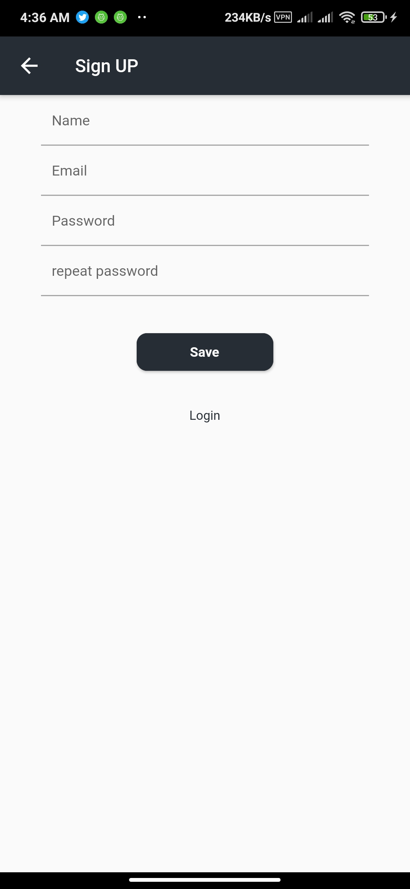

# movie

A new Flutter project.

## Getting Started

I used BLOC state management to contact between app and API to get the new and trending movies.
used SQLite to save the favorite movie.
any user can login by facebook or google.

## Pictures of app

# use App
  - download code and run it
